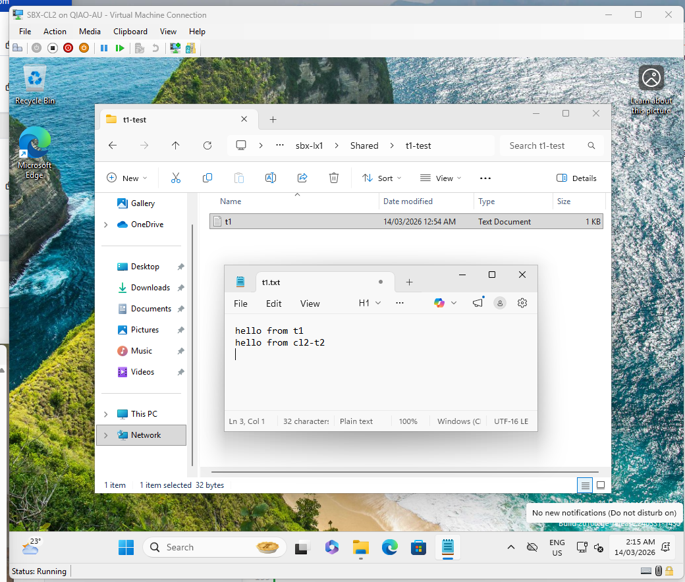

# sbx-cl2 Samba Validation

## Purpose

This document records Samba validation from `sbx-cl2`.

The goal is to verify Samba share behaviour from a second SBX workstation using a separate client context.

## Validation Scope

This validation checks:
- client access to `\\sbx-lx1\Shared`
- second-client read access
- second-client file creation
- cross-user modification behaviour

## Preconditions

Before starting:
- `sbx-cl2` is deployed
- `sbx-cl2` is joined to `SBXQIAO.LAB`
- `sbx-lx1` is online
- Samba on `sbx-lx1` is operational
- the `Shared` share already contains test content created from another client or user

## Validation Steps

### 1. Confirm current logon identity
Record the signed-in user on `sbx-cl2`.

### 2. Confirm basic client network state
Verify:
- hostname
- IP address
- DNS server
- domain connectivity

### 3. Confirm domain controller discovery
Verify that `sbx-cl2` can locate `sbx-dc1`.

### 4. Clear existing SMB sessions
Remove old SMB sessions before testing so the result reflects the current user context.

### 5. Connect to the Samba share
Open `\\sbx-lx1\Shared`.

Record:
- whether access succeeds
- whether a credential prompt appears
- whether integrated logon is used successfully

### 6. Verify existing content visibility
Confirm that existing files and folders are visible.

### 7. Create a new folder
Create a new test folder from `sbx-cl2`.

### 8. Create a new file
Create a new file in the share from `sbx-cl2`.

### 9. Modify an existing file
Attempt to modify a file that was created by another user or client.

Record whether:
- modification succeeds
- read-only behaviour occurs
- access is denied

## Validation Record

| Check | Result | Notes |
|---|---|---|
| Share opens | Pending | |
| Existing content visible | Pending | |
| New folder creation | Pending | |
| New file creation | Pending | |
| Existing file modification | Pending | |
| Credential prompt behaviour | Pending | |

## Interpretation

If `sbx-cl2` can:
- open the share
- see existing content
- create new files
- modify existing shared content

then the Samba share is operating as a collaborative AD-backed share for the tested users.

If `sbx-cl2` can read but cannot modify another user’s files, the share remains operational but the permissions model may still need refinement.

## Notes

This document should be updated with actual results after `sbx-cl2` testing is completed.

# sbx-cl2 Samba Validation

## Purpose

This document records Samba validation from `sbx-cl2`.

The goal is to verify Samba share behaviour from a second SBX workstation using a separate client context.

## Validation Scope

This validation checks:
- client access to `\\sbx-lx1\Shared`
- second-client read access
- second-client file creation
- cross-user modification behaviour

## Preconditions

Before starting:
- `sbx-cl2` is deployed
- `sbx-cl2` is joined to `SBXQIAO.LAB`
- `sbx-lx1` is online
- Samba on `sbx-lx1` is operational
- the `Shared` share already contains test content created from another client or user

## Validation Record

| Check | Result | Notes |
|---|---|---|
| Domain join | In progress | |
| Domain logon as second user | In progress | |
| Share opens | Pending | |
| Existing content visible | Pending | |
| New folder creation | Pending | |
| New file creation | Pending | |
| Existing file modification | Pending | |
| Credential prompt behaviour | Pending | |

## Notes

Update this file with the real results from `sbx-cl2` once the domain join and Samba tests are complete.

## Conclusion

Samba validation from `sbx-cl2` passed.

The `Shared` share on `sbx-lx1` is confirmed operational from a second SBX workstation and a second user context.

This validation confirms:
- domain-authenticated access works
- second-client access works
- read and write operations work
- cross-user file modification works

## Notes

The Samba validation stage for the current SBX lab phase can now be considered complete.